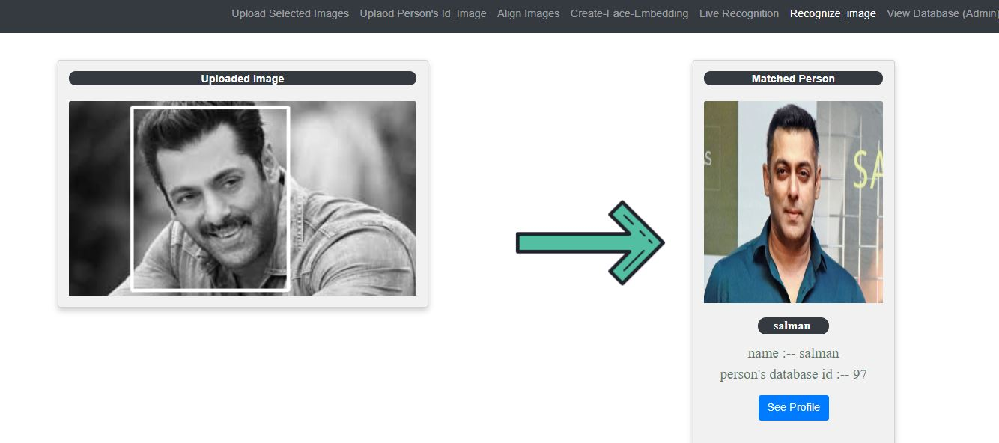

## Pattern Macthing with Optimization using Machine Learning and Deep Learning

- User upload the images with label which needs to be recognized later by the system
- All the images are processed, the face is detectd by the MTCNN Algorithm and and detected face image will be saved in the database
- For each image(face) 128-d vector representation is generated by pre-trained dlib model or facenet model.
- These encodings are then dumped in .pickle file for future inference purposes. 
- For inference, again encodings are generated for face present in the input image.
- Using a threshold value as strictness measure, Euclidean distances are compared through the pickle file and the most closest face is recognised to be that of the user.
- Name and ID of recognised user is displayed.

- RHS image is the image which is saved by the user for later recognition and whose embeddings are stored in .pickle file

- Trained Image of Salman was without Beard, image we given to system to be recognized is having beard, still our system recognises person accurately

- 

